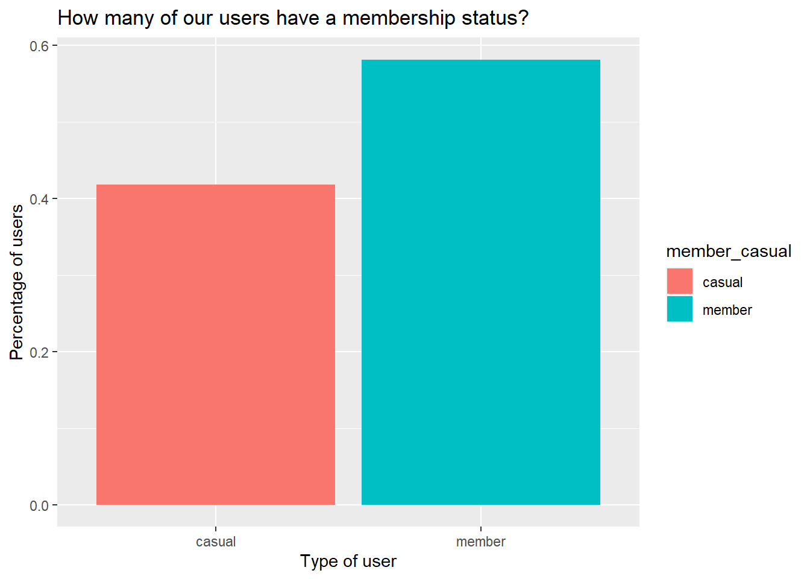
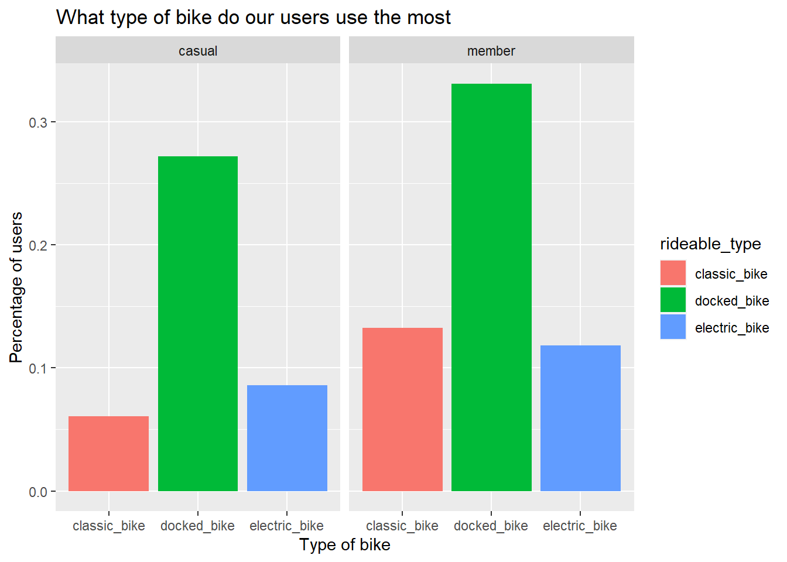
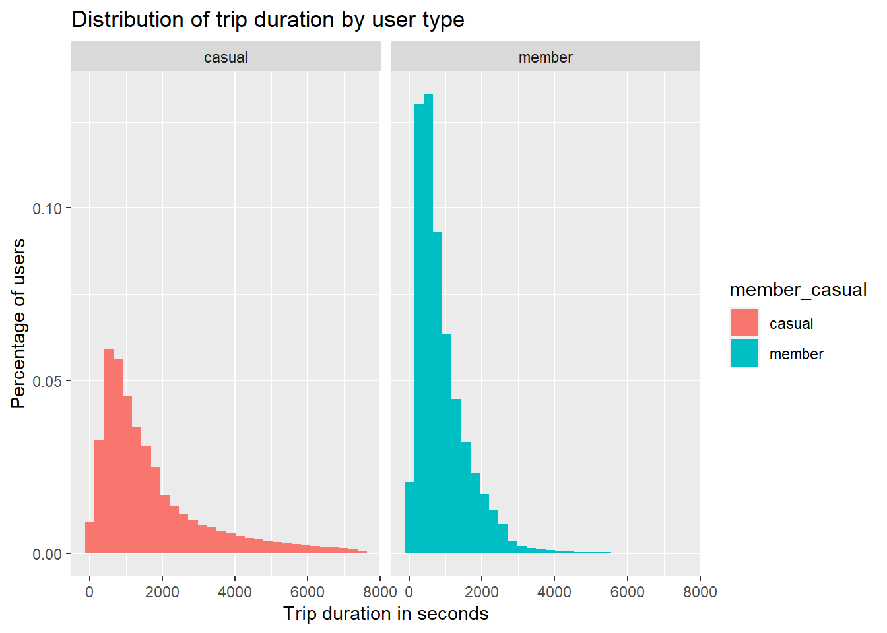
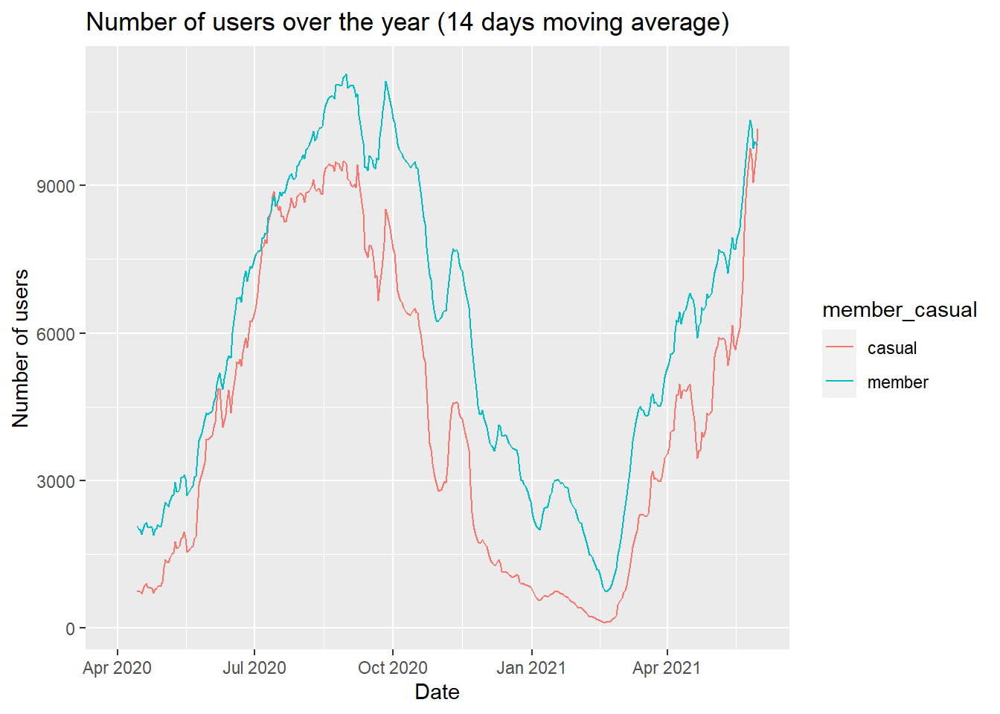

# Analysis

This data analytics report is one the Capstone Exercises for the Google Data
Analytics Course on Coursera. This case study is about a bike-sharing company
that aims to increase the number of annual members (subscribers) as these type
of members are the most profitable for the company.

Information about the company:

- 5800 bikes
- 600 docking stations
- different types of bikes:
  - traditional bikes
  - reclining bikes
  - hand tricycles
  - cargo bikes
- 92% of members use traditional bikes
- 8% of members use the other types of bikes
- 70% of members use bikes for leisure
- 30% of members use bikes for commuting

The task is to answer the first question of the new marketing program:

> How do annual members and casual riders use Cyclistic bikes differently?

## How many users have a membership status?

To answer this question we need to first group the data by each member type and
then calculate some basic descriptive statistics:

In this graph we can see that almost 60% of our users have a membership status.

## What is the most used type of bike?

Both types of users use the `docked bike` the most but, the `member` users use
the `classic bike` more than the `electrict bike`. The `casual` users prefer
the `electric bike` over the `classic bike`.

## For how long do our users travel?

The average `casual` user spends twice more of the time of a `member` during a
trip - 20 minutes versus 11 minutes. And the trip duration is more spread out
among `casual` members. This should be the case of the majority of the users
using bikes for leisure trips as indicated in the basic information.

## How far do our users travel?

Although the distance calculated through the latitude and longitude isn't the
most accurate representation of the distance traveled as trips may not be in a
straight line, it is the only representation that we currently have.

The average `casual` and `member` users travel about the same distance,
however, the `member` users' shorter trips are longer than the `casual` users'.

## When do our users travel?

In this graph we notice that `member` users most probably use our bikes for
commuting during the week as oposed to `casual` members who use our bikes more
at weekends.

## How many users do we have through the year?

It is very difficult to draw conclusions from this graph for the simple fact
that this is not a normal year as the world was affected by COVID-19 and
COVID-19 also has trends. However, we can clearly see a trend in users over the
year so that in the summer there are more users than in the rest of year.

